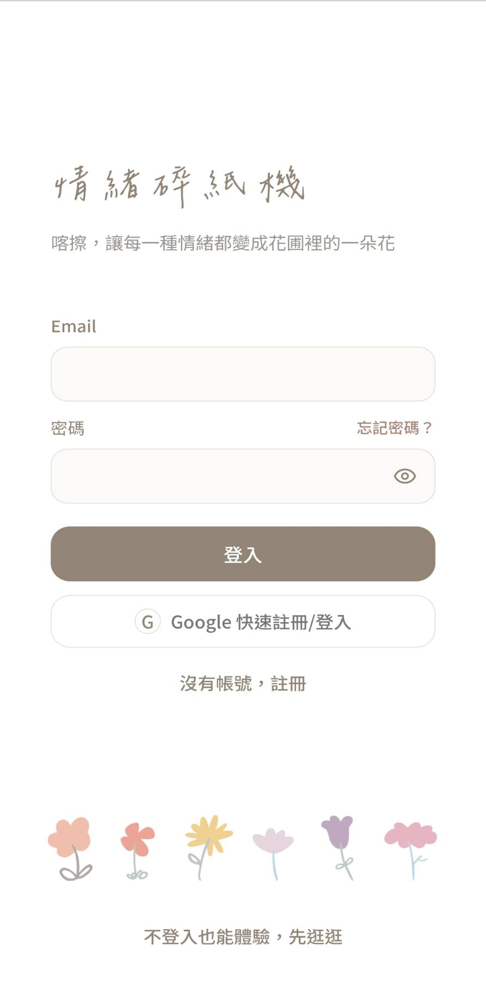
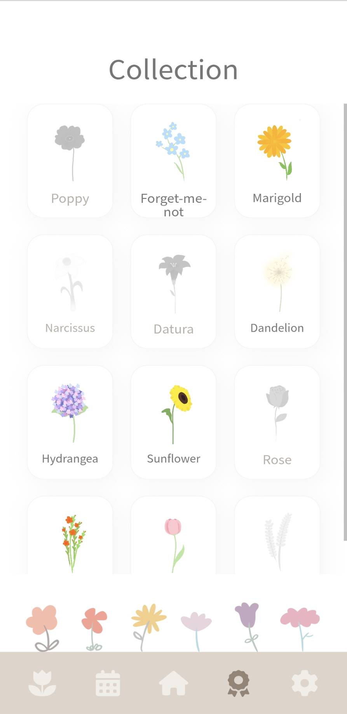

# Emotion Shredder｜APP UI Case Study

**Live demo:** [emotion-shredder-demo.github.io](https://jielle2453.github.io/emotion-shredder-demo/)

Role: UX Research / Interaction Design / UI Design / Prototype Implementation
Deliverables: Mobile app UI, interactive React/Vite prototype, AI emotion-analysis flow, Supabase data architecture

---

## Overview

Emotion Shredder is a mobile interface prototype built around emotional release. Users write down a feeling that's hard to process, then tap the shredder to complete a satisfying "snip" ritual. AI generates a keyword, a short summary, and a matching flower. Today's entry first appears as a small sprout — it only blooms into a flower the next day, entering the garden, calendar, and collection systems.

> Slogan: Type it out, shred it, and watch it grow into a flower.

This isn't a mental-health diagnostic tool. It's a low-pressure, gentle, ritual-driven space for processing emotion — turning "the feeling I want to let go of" into "a flower I once took care of."

<video src="shredder-animation.mp4" controls width="280"></video>

---

## The Problem

Traditional emotion-tracking tools tend to hit three walls: **high input cost** (naming an emotion, writing at length), **feedback that's too clinical** (charts and scores can't hold a raw feeling), and **the pressure of keeping a record** (negative text sitting in a journal that you don't want to revisit). Social media risks image and judgment; therapy isn't suited for everyday small emotions; a traditional diary invites self-censorship; mindfulness apps ask you to be calm first — but people in the middle of anxiety or frustration aren't always ready to be guided.

**Design question:**
> How might we let someone release an overwhelming feeling with very little effort, even when they don't want to fully articulate it — and later let them look back at their emotional history without it feeling heavy?

---

## Research Insights (excerpt)

Early research combined desk research, competitive analysis, and interview planning, targeting 18–32 year-olds who are used to logging their lives on their phones. Key insights:

- **Emotional expression is inherently conflicted** — the more fluent people are in social media norms, the more they self-censor. They need a space where they don't have to maintain an image.
- **A sense of usefulness builds attachment more than being "heard" does** — if each release produces a flower or a flower's meaning, people are more likely to feel "I did something good for myself."
- **Privacy is a precondition, not a feature** — the product must clearly state what's sent to AI, what's stored, and how to delete it.
- **Late-night use needs low-stimulation design** — no onboarding or achievements needed, just a quiet, direct interaction with a clear sense of closure.

The research also drew on affect-labeling literature (naming an emotion reduces the intensity of the emotional response) and studies on the psychological "closure" created by physically discarding a written thought — both of which shaped the shredding ritual and the flower transformation.

---

## Core Concept: Shredder + Garden

| Element | Meaning |
| --- | --- |
| Paper | An unprocessed feeling |
| Shredder | The act of actively letting go |
| AI analysis | Turns a messy feeling into a keyword and a short, gentle summary (never a diagnosis) |
| Sprout | The feeling is still settling; it isn't shown as a flower until the next day |
| Flower / Garden | A settled emotional record, and the long-term accumulated landscape |

---

## Key Screens & Flows

**Onboarding & entry** — email/Google sign-in or guest mode, lowering the barrier to a first try.

**The shredding ritual** — free text input, a tap on the shredder, animation and sound complete the release. This is the emotional core of the product, so it's shown here as a short clip rather than a static screen.

<video src="shredder-animation.mp4" controls width="280"></video>

**Calendar review** — dates are marked with flowers, making it easy to find a specific day's emotional state. On the 1st of each month, a "monthly bouquet" unlocks, gathering the past month's blooms into a downloadable/shareable card.

**Daily record** — opened from the calendar, showing that day's summary, emotion label, keyword scraps, and an editable note.

**The garden & collection** — revealed flowers grow into a dynamic garden that accumulates into a visual slice of a life; tapping a flower makes it sway, and tapping the background toggles the weather/mood. 12 flowers correspond to different emotions and are unlocked one by one into a personal flower glossary.

<video src="garden-interaction.mp4" controls width="280"></video>

**Privacy & control** — guest mode lowers the barrier to a first try; settings offer bilingual language support, a privacy/AI-use explanation, and the ability to delete all records.

---

## Key Design Decisions

1. **No mood scores** — scoring turns emotion into a good/bad performance metric; flowers and their meanings are used as symbols instead.
2. **Free input first, AI names it after** — when emotions are messy, users often can't name the feeling accurately up front.
3. **Today's entry shows only a sprout** — separating the moment of venting from later reflection, so users aren't staring at raw text at the peak of an emotion.
4. **Guest mode is available** — trust in an emotional product takes time; forcing sign-in raises the barrier too early.
5. **Raw text is decoupled from the emotional record** — the intended production direction is that raw text is only used momentarily for AI analysis and never enters long-term storage; only the date, keyword, emotion label, summary, and flower ID are kept long-term.

---

## Tech Stack

The front end is built with React, Vite, and Tailwind CSS as an interactive demo. The back end calls Gemini for emotion analysis through a Supabase Edge Function, with records stored in Supabase (Row-Level Security restricts each user to their own data). The project also supports PWA installation, browser notifications, and Canvas-generated bouquet cards for the monthly download/share feature.

---

## Reflection & Next Steps

The current prototype already forms a complete loop — from input and AI analysis, through storage, to garden/calendar/collection review. The next phase isn't about adding more screens; it's about taking the demo from prototype quality to product quality: a proper onboarding flow, a safety response for high-risk content, true real-time destruction of raw text, and a more consistent component system.

`[TODO: add findings from real user feedback and usability testing]`
