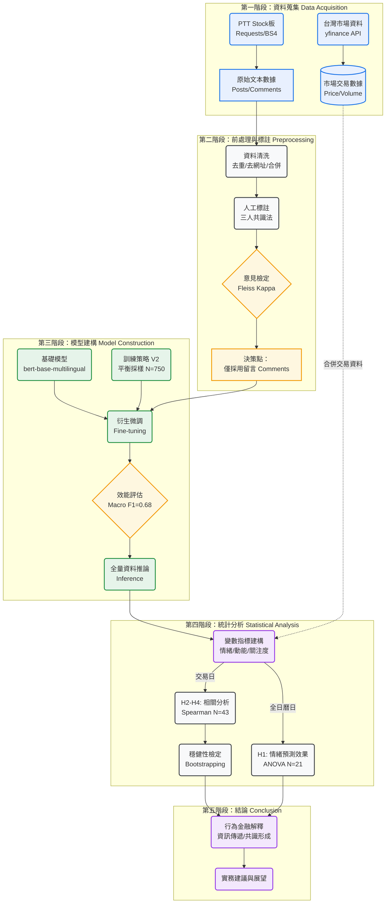

# __事件驅動下的網路社群情緒與市場表現：__

# 以川普關稅政策期間之 PTT 股票版與台股加權指數為例

__Event\-driven Online Community Sentiment and Market Performance: __A Case Study of PTT Stock Board and Taiwan Weighted Stock Index During the Trump Tariff Policy Period

學習科學學士學位學程  
大學部專題報告

學生：王語揚、呂筱婕、林峻霆  
指導教授：李良一、吳清麟  
國立臺灣師範大學  
中華民國 114 年

# __摘要__

本研究旨在探討 2025 年 3 月至 4 月間，美中關稅政策由突襲宣布至暫緩實施之衝擊期間，台灣最大散戶社群 PTT 股票板的情緒動態與台股加權指數（TAIEX）之互動機制。研究結合自然語言處理（NLP）與事件研究法，採用經領域微調之 BERT 模型（Fine\-tuned BERT），針對 PTT 留言進行高信度的情緒分類，並透過雙軌制時間序列分析，檢視社群情緒在極短期重大事件中的結構變動、同步性與預測力。

研究結果呈現四項主要發現：第一，政策衝擊造成社群情緒結構發生顯著斷裂（Structural Break），其中最具顯著性的變化並非負面恐慌的單向飆升，而是「中性情緒」的階梯式上升，反映出市場在高度不確定性下的資訊焦慮與觀望需求。第二，社群情緒水準（Level）與市場價格走勢呈現高度同步的鏡像共動（Co\-movement），證實 PTT 輿情可作為市場位階的同步指標。第三，在捕捉市場 V 型反轉訊號上，「兩日情緒動能（Lag\-2 Momentum）」之解釋力顯著優於單日情緒變化，揭示了市場共識形成約需 48 小時的發酵機制。第四，社群討論量與市場波動度呈現顯著正相關。

綜合而言，本研究證實了在極短期政策衝擊下，散戶社群的非結構化文本隱含著具體的市場行為密碼。透過觀測情緒動能與關注度指標，投資人能更精確地掌握市場反轉節奏與風險情境。

__關鍵字：__ 投資人情緒、事件研究、PTT、BERT模型、情緒動能、市場波動、關稅政策

# __Abstract__

This study investigates the dynamic relationship between investor sentiment on the PTT Stock Board—Taiwan's largest retail investor forum—and the Taiwan Stock Exchange Capitalization Weighted Stock Index \(TAIEX\) during the 2025 U\.S\.\-China tariff policy shock\. Integrating Natural Language Processing \(NLP\) with event study methodology, this research employs a domain\-adapted BERT model, fine\-tuned on a balanced corpus of forum comments, to extract high\-reliability sentiment signals\. Through a dual\-track time\-series analysis, the study examines the structural shifts, synchronicity, and predictive power of online sentiment during this short\-term extreme event\.

The empirical results yield four major findings\. First, the policy shock induced a significant structural break in sentiment composition\. Notably, this was characterized not merely by a surge in negative panic, but by a substantial rise in "neutral sentiment," reflecting heightened information anxiety and uncertainty among retail investors\. Second, sentiment levels exhibited a strong synchronous co\-movement with market prices, confirming that PTT sentiment serves as a reliable coincident indicator of market status\. Third, regarding market reversals, "Lag\-2 Sentiment Momentum" demonstrated significantly superior explanatory power compared to daily sentiment changes, suggesting a 48\-hour consensus formation mechanism behind the V\-shaped market recovery\. Fourth, discussion volume was found to be strongly correlated with market volatility, supporting the Attention\-Driven Volatility hypothesis\.

Overall, this study demonstrates that unstructured text data from retail communities contains critical market behavior signals during policy shocks\. By monitoring sentiment momentum and investor attention, market participants can better gauge the timing of market reversals and risk environments\.

__Keywords:__ Investor Sentiment, Event Study, PTT, BERT, Sentiment Momentum, Attention\-driven Volatility, Tariff Policy

# __第一章　緒論__

## __1\.1 研究背景__

在當前金融市場中，社群媒體已成為散戶投資人（Retail Investors）獲取資訊、交換觀點與宣洩情緒的核心場域。行為金融學（Behavioral Finance）指出，市場並非總是效率的，投資人的非理性行為與群體情緒（Herd Behavior）往往能顯著影響資產價格，特別是在面臨突發性重大事件時，這種影響更為劇烈。

台灣股市（TAIEX）作為淺碟型市場，散戶交易佔比高，極易受國際地緣政治與財經政策的影響。2025 年 3 月底至 4 月初，美國政府無預警宣布對中國進口之科技產品加徵懲罰性關稅，此一政策震撼全球供應鏈。由於台灣電子產業位處供應鏈核心，市場預期心理受到劇烈衝擊，台股隨即面臨恐慌性修正，直至後續政策暫緩消息釋出後才呈現 V 型反彈。

在此期間，全台最大的散戶論壇—__PTT 實業坊股票板（Stock）__，湧入了大量的討論與情緒性留言。這些非結構化的文本數據（Unstructured Data）不僅記錄了散戶當下的恐慌與貪婪，更可能蘊含著市場反轉的重要訊號。然而，傳統金融研究多聚焦於結構化交易數據，較少探討在__極短期政策衝擊__下，社群情緒如何透過「共識形成」與「注意力聚集」來驅動市場的劇烈波動。

因此，本研究以 2025 年關稅政策衝擊為個案，結合自然語言處理（NLP）技術與事件研究法，試圖解構社群情緒與市場反應之間的動態關聯。

## __1\.2 研究動機__

本研究之動機源於對現有市場現象與學術缺口的觀察，主要可歸納為以下三點：

__第一，填補「極短期政策衝擊」下的情緒研究缺口__ 既有文獻多聚焦於長週期的情緒與股價關係（如月度或季度），較少針對單一突發重大事件（10\-20 天內）進行微觀分析。然而，政策衝擊往往在數日內引發市場劇烈震盪，本研究欲探討在此極短時間窗口內，社群情緒是否會出現結構性的斷裂或質變。

__第二，探索「情緒動能（Momentum）」作為市場反轉之訊號__ 市場在暴跌後往往伴隨著 V 型反轉。本研究欲探討：社群情緒是單純隨市場波動的雜訊，還是具備某種「動能」特徵？亦即，是否需要累積一定時間（如 48 小時）的情緒共識，才能有效確認市場的反轉點？此一「情緒動能」觀點將有助於釐清散戶信心回復的節奏。

__第三，驗證「社群關注度」與市場風險之關聯__ 在事件發生期間，PTT 討論量出現異常暴增。本研究動機在於驗證「投資人注意力（Investor Attention）」理論在台股的適用性，即探討社群的高聲量是否即代表市場的高風險（波動度），進而為投資人提供量化的風險預警指標。

## __1\.3 研究目的__

__基於上述背景與動機，本研究旨在建構一套適用於台灣財經社群的文本分析框架，並達成以下具體目的：__

1. __分析情緒結構變動： 檢視在政策宣布（衝擊期）與暫緩（恢復期）等不同階段，PTT 社群的正、負面與中性情緒分佈是否發生顯著的結構性改變。__
2. __檢驗情緒同步性： 探討社群的情緒水準（Sentiment Level）是否能即時反映大盤指數的累積報酬走勢，確認其作為「同步指標」的有效性。__
3. __建構動能指標： 比較「單日情緒變化」與「多日情緒動能（Lag\-k Momentum）」對市場反轉的解釋力，找出最具預測價值的時間窗口。__
4. __驗證注意力效應： 檢驗社群討論量（Volume）的激增是否與市場波動度（Volatility）呈現顯著的正向關聯。  
__

## __1\.4 研究問題__

本研究擬回答以下核心問題：

__RQ1：政策衝擊期間，PTT 股票版情緒是否呈現結構性改變？__

__RQ2：社群「情緒水準（Level）」是否與市場價格趨勢呈現同步共動？__

__RQ3：社群「情緒變化（Change）」中，何種時間跨度的動能指標最能反映市場反轉？__

__RQ4：社群討論量變化量是否與市場波動度相關？__

## __1\.5 研究假設__

本研究提出以下假設：

### __H1：政策衝擊期間，PTT 股版情緒結構於 P1/P2/P3 三階段之間存在顯著差異。__

### __H2：PTT 社群的正面與中性與負面情緒佔比（Level）各自與大盤累積報酬呈現顯著的相關性。__

### __H3：兩日情緒動能（Momentum, k=2）對市場反轉的解釋力，顯著優於單日情緒變化量（Diff）。__

### __H4：討論量（Volume / Volume Ratio）與市場波動度呈顯著正相關。__

## __1\.6 論文架構__

本專題報告共分五章，各章節內容安排如下：

- __第一章　緒論：__ 闡述研究背景、動機、目的、問題與假設，確立研究核心價值。
- __第二章　文獻探討：__ 回顧行為金融學、事件研究法、社群情緒分析及注意力理論之相關文獻，建立理論基礎。
- __第三章　研究方法：__ 詳述資料來源、變數定義、BERT 模型微調流程（含 Kappa 信度檢定）及雙軌制統計分析策略。
- __第四章　研究結果：__ 呈現敘述統計、ANOVA 結構分析、情緒與市場之相關性檢定，以及穩健性測試結果。
- __第五章　討論與結論：__ 綜合歸納實證發現，提出行為機制解釋（如 48 小時共識、資訊焦慮），並說明學術貢獻、實務意涵與研究限制。

# __第二章　文獻探討（Literature Review）__

本研究結合行為金融學、事件研究法與自然語言處理的文本情緒分析，以理解政策衝擊事件中社群情緒與市場反應的互動。因此，本章將從五個面向進行整理：（1）行為金融學與市場情緒；（2）社群媒體與金融市場；（3）事件研究法在政策衝擊研究中的應用；（4）自然語言處理（NLP）之情緒分類方法；（5）社群討論量扮演的角色。

## __2\.1 行為金融學與市場情緒（Behavioral Finance & Market Sentiment）__

傳統金融理論（Fama, 1970）認為市場趨於有效，價格反映所有資訊。然而大量實證研究指出，投資人並非完全理性，其情緒與偏誤（bias）會造成市場過度反應（overreaction）或反應不足（underreaction）（Shiller, 2003）。

### __（一）市場情緒作為價格動能來源__

Baker 與 Wurgler（2006）指出，市場情緒會影響投資人的風險偏好（risk appetite），在高不確定性事件中，情緒更可能主導交易行為。Barberis et al\.（1998）也提出，情緒變化具有「延續性（persistence）」特性，可能形成價格動能（momentum）。

### __（二）極端事件中的情緒加速效應__

在重大政策衝擊（如關稅、戰爭威脅）中，市場常會經歷短期劇烈震盪（Kaminsky & Schmukler, 1999），投資人情緒更具影響力。此一背景與本研究高度吻合：市場在 4/7 大幅下跌後，短短三日內出現 V 型反轉，情緒可能扮演重要角色。

## __2\.2 社群媒體與金融市場（Social Media Sentiment and Financial Markets）__

近十年來，社群平台（Twitter、Reddit、Weibo、PTT）亦成為衡量市場情緒的重要資料來源。此領域的核心共識包括：

### __（一）社群情緒與市場報酬具顯著關聯__

Bollen et al\.（2011）發現，Twitter 情緒可提前數日預測道瓊指數。Sprenger et al\.（2014）研究發現，社群正面語氣與交易量、報酬呈正相關。

### __（二）社群討論量反映市場關注度（Attention）__

Da et al\.（2011）提出「投資人注意力指標（Investor Attention Index）」，指出搜尋量與討論熱度上升時，市場波動率亦增加。Reddit / r/wallstreetbets 研究（Lyócsa et al\., 2021）進一步顯示，社群的突發性討論能引發劇烈市場反應（如 GME 事件）。

## __2\.3 事件研究法（Event Study）與政策衝擊研究__

事件研究法（MacKinlay, 1997）被廣泛用於研究特定事件（政策公告、財報、地緣政治）對市場之短期影響。

### __（一）事件分期法（P1 / P2 / P3）__

事件研究通常將期間劃分為三段：

- 前期（Pre\-event）  

- 衝擊期（Event window）  

- 後期（Post\-event）  

此方法可比較事件前後市場行為的結構性改變。較新的研究（Chen & Siems, 2004）指出，在突發政策或危機中，此分期可清楚捕捉市場不確定性與反轉行為。

本研究採 P1（3/27–4/2）、P2（4/3–4/9）、P3（4/10 \- 4/16）設計，符合事件研究之標準框架。

### __（二）社群情緒在事件研究法中的角色__

以往事件研究主要觀察「價格與報酬」；本研究則將「社群情緒」引入事件視窗中，補強事件研究法對「投資人心理」的觀察能力，亦與近年「情緒事件研究（Sentiment\-based Event Study）」的發展一致（Tetlock, 2007）。

## __2\.4 自然語言處理（NLP）之情緒分類技術__

本研究採用 BERT 模型進行情緒分類，其學理背景如下：

### __（一）BERT 模型與微調（Fine\-tuning）__

Devlin et al\.（2019）提出 BERT（Bidirectional Encoder Representations from Transformers），其雙向注意力機制能處理語句語意，成為 NLP 標準架構。在金融與社群文本中，Fine\-tuned BERT 已被證實比詞袋模型或 LSTM 具更高效能（Araci, 2019）。

### __（二）針對社群文本的標註與一致性__

社群語言具特殊語氣（反諷、梗語、縮寫）。研究指出，金融領域的情緒分類需要：

- 領域語料（Domain\-specific Corpus）  

- 人工標註一致性（Inter\-annotator Agreement）  

- 垃圾訊號處理（URL、重複字、灌水）  

本研究遵循該實務，進行資料清洗與文本合併，以提升模型可靠度。

## __2\.5 討論量變化量__

### __（一）社群討論量作為注意力代理變數（Attention Proxy）__

Antweiler & Frank（2004）指出，討論量與不確定性顯著相關。本研究發現的「討論量倍增約 4\.1 倍」正符合 Attention 理論。

### __（二）事件衝擊期間的波動性升高__

政策衝擊會激發投資人搜尋行為與討論行為，導致市場波動率上升（Vlastakis & Markellos, 2012）。  
 本研究的波動性檢定（|R|）亦驗證此現象。

# __2\.6 本章小結__

然而，既有文獻多聚焦於長期或跨事件情緒趨勢，較少檢視極短期政策衝擊中社群情緒的微觀結構變動，以及情緒動能與注意力波動之間的互動。本研究填補此研究缺口。

本章從五大領域回顧先前文獻，指出：

1. 行為金融學顯示情緒在短期事件中主導投資行為。  

2. 社群媒體是強力的情緒來源與市場鏡像。  

3. 事件研究法適合分析政策衝擊期間的短期市場反應。  

4. BERT 模型適合處理 PTT 等領域語料之情緒分類。  

5. 討論量與注意力常與市場波動性呈現共同變動或同步放大現象。  

這些理論為本研究之方法、本研究問題與分析結果提供堅實基礎。

# __第三章__

# __研究方法__

本章旨在說明本研究之資料來源、變數操作化定義、模型建構流程以及統計分析策略。本研究採用「自然語言處理（NLP）」結合「事件研究法（Event Study）」之混合研究設計。內容安排如下：第一節闡述研究架構與資料雙軌處理機制；第二節說明變數定義；第三節詳述深度學習模型之微調與評估流程。

## __3\.1 研究設計與資料來源__

### __3\.1\.1 研究架構__

本研究旨在探討政策衝擊期間社群情緒與市場反應之互動。研究邏輯分為三個層次：

1. __結構層（Structure）：__ 檢視事件前後，社群情緒分佈是否發生結構性斷裂。
2. __狀態層（Level）：__ 檢視社群當下的情緒水準（Level）是否與市場走勢同步。
3. __動態層（Dynamics）：__ 比較單日變化（Diff）與累積動能（Momentum），何者更能捕捉市場反轉訊號。

### __3\.1\.2 研究對象與資料雙軌制 \(Dual\-Track Data Processing\)__

__1\. 研究對象__

- __社群數據：__ 選定台灣 PTT 實業坊股票板（Stock）為輿情來源。
- __市場數據：__ 選定台灣加權股價指數（TAIEX, ^TWII）之日交易數據，資料來源為 yfinance API。

__2\. 資料期間與處理策略__ 本研究期間為 2025/03/27 至 2025/04/16，共計 21 個日曆日。鑑於社群討論具有連續性（週末不休市），而股市具有間斷性（僅交易日開盤），本研究採取「雙軌制時間序列處理」：

- __全日曆日樣本（Calendar Days, N=21）：__ 用於 __ANOVA 變異數分析__。
	- 理由： 政策衝擊與情緒發酵往往跨越週末（例如週六日的恐慌討論）。為完整捕捉情緒結構的演變，本部分將期間劃分為 P1、P2、P3 各 7 日的完整視窗，不排除休市日數據。
- __交易日交集樣本（Trading Days, N=13）：__ 用於 __Spearman 相關性分析__。
	- 理由： 在檢視情緒與股價之連動時，需確保兩變數在時間軸上嚴格對齊，故排除休市日，僅保留開盤日數據。

### __3\.1\.3 研究工具__

本研究使用 Python 開發環境，主要工具如下：

- __資料獲取：__ Requests, BeautifulSoup \(爬蟲\), yfinance \(股市資料\)。
- __資料儲存：__ SQLite \(關聯式資料庫\)。
- __模型訓練：__ PyTorch, Hugging Face Transformers \(BERT 模型微調\)。
- __統計分析：__ SciPy, Pandas, NumPy \(統計檢定與數據處理\)。

## __3\.2 變數操作化定義__

為回答研究問題 RQ2（情緒水準同步性）與 RQ3（情緒動能有效性），本研究將情緒變數區分為「水準」與「動態」兩類。

### __3\.2\.1 情緒水準指標 \(Sentiment Level\)__

用於衡量「當下」的市場心理狀態。

令 $$N_{pos}, N_{neg}, N_{neu}$$ 分別為當日正面、負面、中性留言數，總留言數 $$N_{total}$$。

- __正面情緒佔比：  
$$Pos_prop_t = \frac{N_{pos,t}}{N_{total,t}}$$__
- __負面情緒佔比：  
$$Neg_prop_t = \frac{N_{neg,t}}{N_{total,t}}$$__
- __中性情緒佔比：  
$$Neu_prop_t = \frac{N_{neu,t}}{N_{total,t}}$$__

### __3\.2\.2 情緒動態指標 \(Sentiment Dynamics\)__

用於衡量情緒的「變化幅度」與「趨勢力道」。

- 單日情緒變化 \(Difference, Diff\)：  
$$\Delta Pos_t = Pos_prop_t - Pos_prop_{t-1}$$  
此指標反映情緒的「邊際變化」，用於測試極短期波動是否具資訊含量。
- 情緒動能 \(Momentum\)：  
$$Momentum\(k, t\) = Pos_prop_t - Pos_prop_{t-k}$$  
此指標反映 k 日內的累積情緒位移。本研究將測試 k=2（兩日動能）對市場反轉的解釋力。

### __3\.2\.3 關注度與市場指標__

- __討論量倍數 \(Volume Ratio\)：__ $$Vol_Ratio_t = \frac{Volume_t}{Avg\(Volume_{P1}\)}$$
- __市場報酬 \(Return\)：__ $$R_t = \ln\(P_t / P_{t-1}\)$$
- __市場波動度 \(Volatility\)：__ $$|R_t|$$ \(絕對報酬\)

## __3\.3 研究流程 \(Research Process\)__

\[圖 3\-1：本研究之研究流程圖\]

本研究之執行流程共分為四個主要階段：資料蒐集、資料前處理與標註、模型建構與微調、以及統計分析。整體流程架構如圖 3\-1 所示，各階段詳細內容說明如下。

### __3\.3\.1 資料蒐集與前處理__

__1\. 爬蟲統計__ 本研究共蒐集 PTT Stock 板原始文章 4080 篇、標題 4080 則、留言 432167 則。

__2\. 資料清洗__ 執行去重（同人同分鐘合併）、去除網址與格式化符號後，獲得有效留言392413則。

### __3\.3\.2 手動標註程序與信度檢定 \(Human Annotation\)__

為建立高品質的訓練資料集（Ground Truth），本研究制定嚴謹的標註規範與共識機制。

1\. 標註分類定義

本研究將情緒劃分為三類，標註準則如下：

- __Positive（Pos）：__ 樂觀、看多、讚許。包含對後市看漲、對政策表示支持或使用正面情緒詞彙之文本。
- __Negative（Neg）：__ 悲觀、看空、批評。包含對後市看跌、恐慌宣洩、謾罵或對政策表示強烈反對之文本。
- __Neutral（Neu）：__ 資訊陳述、無多空傾向、閒聊。包含單純新聞轉貼、詢問資訊、或無法判斷多空方向之反諷語句。

2\. 三人共識標註法 \(Three\-person Consensus Strategy\)

為降低主觀偏誤，每筆資料皆由三位標註者獨立判斷，並依循以下原則決定最終標籤：

- __完全一致（3/3）：__ 三人標註相同直接收錄。
- __多數決（2/3）：__ 兩人一致、一人不同採多數意見收錄。
- __未達成共識（Disagreement）：__ 三人標註皆不同視為雜訊過高或語意不清，__予以排除__，以確保模型訓練資料之可靠度。

3\. 標註一致性檢定 \(Fleiss' Kappa\)

經上述程序標註後，本研究進一步計算 Fleiss' Kappa 係數以檢驗不同文本類型之標註信度（見表 3\-1）。

__表 3\-1：人工標註一致性檢定結果__   

__文本類型 \(Text Type\)__

__Fleiss' Kappa 值__

__一致性強度 \(Interpretation\)__

__資料決策 \(Decision\)__

標題 \(Title\)

0\.2377

Fair agreement \(低度一致\)

剔除 \(Discard\)

內文 \(Content\)

0\.4452

Moderate agreement \(中度一致\)

剔除 \(Discard\)

__留言 \(Comment\)__

__0\.6509__

__Substantial agreement \(高度一致\)__

__採用 \(Adopt\)__

基於 Kappa 檢定結果，標題與內文因語意模糊導致標註者共識度不足，故本研究僅採用「留言」作為模型訓練語料，以確保訓練資料之品質。

### __3\.3\.3 模型架構與訓練流程 \(Model Training Pipeline\)__

__本研究採兩階段訓練策略，首先選定預訓練模型，再針對 PTT 語域進行微調（Fine\-tuning）。__

1\. 原始預訓練模型基礎 本研究選用 Hugging Face 之 nlptown/bert\-base\-multilingual\-uncased\-sentiment 作為基礎模型（Base Model）。

- 模型架構： bert\-base\-multilingual\-uncased
- 預訓練任務： 五分類情感分析（1–5 Stars）
- 訓練語言： 英、法、德、荷、義、西語
- 訓練資料： 約 62,9000 則產品評論（Product Reviews）
- 選用理由： 該模型具多語言能力，且其星級評分機制（1\-2星負面、3星中性、4\-5星正面）與本研究邏輯相容，適合遷移學習。

2\. 模型限制與微調必要性 雖然原始模型具備基礎語意理解能力，但其訓練語料為「商品評論」，難以直接應用於 PTT 財經社群。PTT 充斥著口語、諧音梗（如：塊陶、接刀）、反諷與專有術語，故必須進行領域微調（Domain Adaptation）。

3\. 資料集配置 \(Dataset Splitting\) 本研究共執行兩階段實驗（V1 與 V2），其資料配置如表 3\-2 所示。

- V1 \(General\)： 使用全量資料，因類別嚴重不平衡（中性多、正面少），導致模型失效。
- V2 \(Final\)： 針對「留言」進行人工平衡採樣（各類別 250 筆），依 8:1:1 比例劃分訓練、驗證與測試集。此為本研究最終採用之配置。

__表 3\-2：模型訓練資料集分佈統計__

__模型版本__

__資料集 \(Set\)__

__總筆數 \(Total\)__

__正面 \(Pos\)__

__負面 \(Neg\)__

__中性 \(Neu\)__

__備註__

__V1 \(General\)__

__訓練集 \(Train\)__

__420__

53

148

219

資料嚴重不平衡

__驗證集 \(Val\)__

__90__

11

32

47

用於監控 Loss

__測試集 \(Test\)__

__210__

70

70

70

平衡測試集

__V2 \(Final\)__

__訓練集 \(Train\)__

__750__

__250__

__250__

__250__

__類別完全平衡__

__驗證集 \(Val\)__

__120__

40

40

40

用於監控 Loss

__測試集 \(Test\)__

__210__

70

70

70

平衡測試集

  
4\. 訓練參數設定

使用 PyTorch 框架進行微調，設定 Batch size 為 16，Learning rate 為 2e\-5，Epochs 為 4，並使用 AdamW 優化器。

### __3\.3\.4 模型效能評估__

1\. 評估指標

採納 Macro\-average F1\-score 作為主要指標，公式如下：

$$Precision = \frac{TP}{TP + FP}, \quad Recall = \frac{TP}{TP + FN}$$

$$F1\text{-}Score = 2 \times \frac{Precision \times Recall}{Precision + Recall}$$

2\. 效能比較結果

表 3\-3 顯示，V1 模型因資料偏誤導致 F1 僅 0\.232；V2 模型經平衡微調後，F1 大幅提升至 0\.683，證明標註程序與資料平衡之必要性。

__表 3\-3：模型效能比較 \(Test Set N=210\)__

__模型版本__

__Accuracy__

__Precision__

__Recall__

__F1\-Score__

__說明__

V0 \(Baseline\)

0\.514

0\.497

0\.514

0\.475

原始預訓練模型

V1 \(General\)

0\.357

0\.335

0\.357

0\.232

受資料不平衡影響

__V2 \(Final\)__

__0\.686__

__0\.713__

__0\.686__

__0\.683__

__最佳模型__

__分析結果：__

- __V0 限制：__ 雖具基礎能力，但無法理解中性語句（Neutral Recall 僅 0\.15），常過度預測負面。
- __V1 失敗：__ 雜訊與不平衡導致模型崩壞，幾乎無法辨識正面情緒。
- __V2 優勢：__ 經平衡微調後，Macro F1 提升至 0\.683，且在正、負、中性三類別之 F1\-score 分別達到 0\.73、0\.69、0\.63 之水準，顯著優於基準模型。

__3\. 混淆矩陣分析 \(Confusion Matrix\)__

\[圖 3\-2：V2 模型混淆矩陣圖\]

圖 3\-2 顯示 V2 模型之錯誤分佈。雖然部分中性文本因 PTT 的反諷文化（Sarcasm）而被誤判為負面，但整體對角線分佈清晰，顯示模型已具備足夠的分類信度。

__小結：__ 綜上所述，V2 模型在正確率、類別平衡性與 F1 分數上皆為最佳，故本研究後續將全數採用 V2 模型進行推論。

### __3\.4 統計分析策略__

本研究最終採用 V2 模型對全量資料進行推論，並執行以下統計分析：

1. __單因子變異數分析 \(ANOVA\)：__ 使用 N=21 全日曆日樣本，檢定三期間情緒結構差異。
2. __Spearman 等級相關分析：__ 使用 N=13 交易日樣本，檢定情緒水準、動態指標與市場報酬之關聯。
3. __穩健性檢定 \(Robustness Check\)：__ 採用拔靴法 \(Bootstrapping\) 估計相關係數之信賴區間，確保小樣本下之推論穩健性。

# __第四章 研究結果__

本章旨在呈現本研究之實證結果，以檢驗四項研究假設並回答對應之研究問題。章節安排依循「結構—狀態—動態」的邏輯層次：

\(1\) 先描述資料概況與雙軌處理方式；

\(2\) 檢視政策衝擊前後社群情緒結構的變化（H1）；

\(3\) 分析情緒水準與市場報酬的同步關聯（H2）；

\(4\) 檢驗不同情緒動能指標的市場解釋力（H3）；

\(5\) 評估關注度與市場波動度之關係（H4）；

最後進行穩健性檢定以確認結果一致性。

## __4\.1 描述統計與事件進程概述__

本研究觀察期間為 2025/03/27 至 2025/04/16，共 13 個交易日。依事件研究設計，此期間分為三階段：

- __P1 前期（2025/03/27–04/02）  
__
- __P2 衝擊期（2025/04/03–04/09）  
__
- __P3 暫緩期（2025/04/10–04/16）__

## __4\.1\.1 雙軌資料處理（Dual\-Track Data Processing）__

考量社群討論的「連續性」與金融市場的「間斷性」，本研究採雙軌制進行統計分析：

### __\(1\) 情緒結構檢定（ANOVA）使用 N = 21（全日曆日）__

目的在捕捉週末的輿情發酵，使三期間（P1–P3）均具有等長的 7 日資料。

### __\(2\) 市場關聯檢定（Correlation）使用 N = 13（交易日）__

目的在確保情緒指標與股市報酬在時間軸上的嚴格對齊，避免休市日引入偏差。

### __4\.1\.2 變數敘述統計__

表 4\-1 呈現三期間之關鍵變數摘要。

__表 4\-1：各事件子時期之敘述性統計摘要 \(Mean $$\pm$$ Std\) *樣本數：各期間 N=7，總 N=21*__

__變數類別__

__變數名稱__

__P1：前期 \(Pre\)__

__P2：衝擊期 \(Shock\)__

__P3：暫緩期 \(Post\)__

__情緒水準__

正面佔比 \($$Pos$$\)

0\.1713 \($$\pm$$ 0\.024\)

__0\.1396 \($$\pm$$ 0\.022\)__

0\.1578 \($$\pm$$ 0\.011\)

負面佔比 \($$Neg$$\)

0\.5022 \($$\pm$$0\.024\)

0\.4860 \($$\pm$$ 0\.008\)

0\.4643 \($$\pm$$ 0\.025\)

中性佔比 \($$Neu$$\)

__0\.3266 \($$\pm$$ 0\.044\)__

__0\.3743 \($$\pm$$ 0\.022\)__

__0\.3779 \($$\pm$$ 0\.020\)__

__關注度__

日均討論量 \($$Volume$$\)

8,275 \($$\pm$$ 3,175\)

__29,185 \($$\pm$$ 11,042\)__

19,473 \($$\pm$$ 9,397\)

__市場表現__

平均報酬率 \($$R_t$$\)

\-0\.85%

\-6\.50%

\+2\.35%

__初步觀察與意涵__

1. __正面情緒在衝擊期明顯下降  
__P2 正面均值為三期間最低，顯示政策突襲對市場信心造成直接衝擊。
2. __中性情緒取代負面情緒成為主要反應__
	- P2 負面情緒略微下降（0\.502→0\.486）
	- 中性情緒大幅上升（0\.327→0\.374）  
 → 暗示 PTT 使用者在高度不確定情境下，傾向「資訊搜尋與觀望」，呈現資訊焦慮（Information Anxiety）而非恐慌性宣洩。
3. __關注度在衝擊期爆量__  
日均討論量由 P1 的 8,275 跳升至 P2 的 29,185（約 3\.5 倍），顯示該事件引發極高社群注意力。

## __4\.2 事件視窗比較：情緒結構的斷裂 \(H1\)__

為驗證假設 __H1：政策衝擊期間，PTT 社群情緒結構存在顯著差異__，本研究利用 __N=21 全日曆日樣本__ 進行單因子變異數分析（One\-way ANOVA），並透過兩兩獨立樣本 T 檢定（Post\-hoc T\-test）確認差異來源。

### __4\.2\.1 三期間情緒佔比ANOVA檢定__

__表 4\-2：三期間情緒佔比之 ANOVA 檢定結果__

__變數__

__F\-value__

__p\-value__

__η2 \(效果量\)__

__檢定結果__

正面情緒 \(Pos\)

__4\.5518__

__0\.0251 \*__

0\.3359

顯著差異 \(Large Effect\)

負面情緒 \(Neg\)

__6\.0853__

__0\.0096 \*\*__

0\.4034

極顯著差異 \(Large Effect\)

中性情緒 \(Neu\)

__6\.1697__

__0\.0091 \*\*__

0\.4067

極顯著差異 \(Large Effect\)

*註：\* $$p < \.05$$, \*\* $$p < \.01$$。效果量 $$\eta^2 > 0\.14$$ 視為大效果。*

結果證實了「結構性斷裂（Structural Break）」的存在。尤其是中性情緒與負面情緒的 F 值皆超過 6\.0，且效果量（$$\eta^2$$）均大於 0\.40，顯示政策事件對社群情緒結構具有極強的解釋力。

### __4\.2\.2 事後比較分析 \(Post\-hoc Comparison\)__

為釐清情緒變化的具體路徑，本研究進一步檢視各期間之兩兩比較結果（表 4\-3）。

__表 4\-3：情緒佔比之事後比較 \(Post\-hoc T\-test\)__

__比較組合__

__正面情緒 \(Pos\)__

__負面情緒 \(Neg\)__

__中性情緒 \(Neu\)__

__P1 \(前\) vs P2 \(衝擊\)__

__顯著下降__ \($$p=\.024$$\)

$$t=2\.59, d=1\.38$$

無顯著差異 \($$p=\.135$$\)

$$t=1\.68$$

__顯著上升__ \($$p=\.030$$\)

$$t=-2\.58, d=-1\.38$$

__P2 \(衝擊\) vs P3 \(暫緩\)__

邊際顯著回升 \($$p=\.077$$\)

邊際顯著下降 \($$p=\.060$$\)

無顯著差異 \($$p=\.754$$\)

__P1 \(前\) vs P3 \(暫緩\)__

無顯著差異 \($$p=\.215$$\)

__顯著下降__ \($$p=\.013$$\)

$$t=2\.91, d=1\.56$$

__顯著上升__ \($$p=\.021$$\)

$$t=-2\.82, d=-1\.51$$

__綜合分析：__

1. 衝擊當下的反應（P1 $$\rightarrow$$ P2）：  
政策發布當下，社群最顯著的反應是「信心崩盤（Positive 下降）」與「觀望氣氛濃厚（Neutral 上升）」。統計顯示 $$Pos$$ 顯著下降（$$p=\.024$$），而 $$Neu$$ 顯著上升（$$p=\.030$$）。有趣的是，負面情緒 $$Neg$$ 在此階段並未顯著升高，這佐證了前述「資訊焦慮大於情緒宣洩」的論點。
2. 暫緩後的結構質變（P1 $$\rightarrow$$ P3）：  
即使到了政策暫緩期（P3），社群情緒仍未完全回復至 P1 狀態。雖然正面情緒與 P1 無異（$$p=\.215$$），但中性情緒仍維持在高檔（$$p=\.021$$），且負面情緒顯著低於前期（$$p=\.013$$）。這暗示市場經歷衝擊後，投資人變得更加謹慎與理性，PTT 討論風氣從原本的「多空對罵（高 Neg）」轉型為「理性分析與資訊交換（高 Neu）」。

結論 \(H1\)：

假設 H1 獲得強力支持。美中關稅政策不僅造成短期的信心衝擊，更導致 PTT 社群情緒結構發生顯著斷裂，其特徵為「信心的 V 型回復」與「不確定性（中性情緒）的階梯式上升」。

## __4\.3 情緒水準與市場走勢之同步性 \(H2\)__

在確認情緒結構發生斷裂後，本節進一步利用 __N=13 交易日樣本__，檢視社群當下的情緒水準（Sentiment Level）是否與市場價格趨勢呈現同步共動（Co\-movement）。此部分旨在回答研究問題 __RQ2__。

### __4\.3\.1 視覺化分析：多空情緒的鏡像同步__

為觀察情緒指標與市場走勢的相對關係，本研究將每日「正面情緒佔比 \($$Pos_prop$$\)」、「負面情緒佔比 \($$Neg_prop$$\)」與「加權指數累積報酬」分別進行 Z\-score 標準化處理，並繪製趨勢對照圖。

1\. 正面情緒與市場之變動

\[圖 4\-1：正面情緒佔比與市場累積報酬之 Z\-score 走勢圖\]

2\. 負面情緒與市場之變動

\[圖 4\-2：負面情緒佔比與市場累積報酬之 Z\-score 走勢圖\]

3\. 中性情緒與市場之變動

\[圖 4\-3：中性情緒佔比與市場累積報酬之 Z\-score 走勢圖\]

圖表解讀：

綜合觀察圖 4\-1 與圖 4\-2，可發現社群情緒展現了極為精準的市場同步性：

1. 圖 4\-1（正面情緒）顯示，正面情緒與市場累積報酬呈現明顯的同向共動關係。在政策衝擊期間（4/03–4/07），市場快速下跌，正面情緒的 Z\-score 亦同步走弱；而在 4/10 大盤強勢反彈時，正面情緒亦出現顯著回升。此現象顯示散戶的「樂觀程度」能及時反映市場的多空位階，是高度同步的市場情緒指標。
2. 圖 4\-2（負面情緒）則呈現出較為溫和的反向關係。在市場下跌期間，負面情緒確實有所上升，但幅度遠小於市場跌幅；在市場反彈時，負面情緒也隨之下降，但變化同樣平緩。整體而言，負面情緒僅呈現「部分反向」而非鏡像走勢，反映出散戶在政策衝擊期間並非全面陷入恐慌，而是呈現較複雜的混合情緒與資訊焦慮。

這兩組圖表共同證實：PTT 情緒水準並非滯後指標，而是市場狀態的「同步指標（Coincident Indicator）」。

### __4\.3\.2 統計關聯檢定__

為量化上述視覺觀察，本研究使用 Spearman 等級相關係數進行檢定：

- __正面情緒 \($$Pos$$\) vs\. 累積報酬：__ $$\rho = 0\.588$$ \($$p = 0\.035$$, 顯著\)
- __負面情緒 \($$Neg$$\) vs\. 累積報酬：__ $$\rho = -0\.560$$ \($$p = 0\.046$$, 顯著\)

結論 \(H2\)：

統計結果顯示，正面情緒與市場累積報酬呈現顯著正相關（ρ = 0\.588, p = 0\.035），負面情緒則呈顯著負相關（ρ = \-0\.560, p = 0\.046）。這代表在事件衝擊期間，PTT 社群的樂觀程度大致與市場同向變動，而悲觀程度則在市場走弱時相對提升。整體而言，社群情緒確實反映了市場的多空位階，但正面情緒的同步性與一致性更為明顯；負面情緒則僅呈現部分反向關係。

【圖 4\-4 與圖 4\-5 正負面單日情緒變化量 vs\. 報酬】

## __4\.4 情緒動能與市場反轉機制 \(H3\)__

雖然情緒水準能確認「當下狀態」，但投資人更關心的是「反轉訊號」。本節回答研究問題 __RQ3__：在捕捉市場反轉上，「單日變化」與「累積動能」何者有效？

### __4\.4\.1 單日情緒變化 \(Diff\) 的隨機性__

首先檢視情緒的單日情緒變化與市場單日報酬之關係。

- ΔPos_prop 與 Rt：ρ = \.133（不顯著）
- ΔNeg_prop 與 Rt：ρ = \-\.329（不顯著）  

分析結果：

情緒的「昨今變化量」與隔日漲跌並無顯著關聯。這顯示社群情緒的單日波動包含大量隨機雜訊（Noise），不足以形成有效的市場方向訊號。

### __4\.4\.2 情緒動能 \(Momentum\) 的反轉訊號__

接著引入「兩日情緒動能（Lag\-2 Momentum）」，定義為 $$Pos_prop_t - Pos_prop_{t-2}$$，並進行敏感度分析（表 4\-4）。

__表 4\-4：不同滯後期數動能與市場報酬相關性分析 \(N=13\)__

__指標 \(Indicator\)__

__Spearman's ρ__

__p\-value__

__統計意義__

Momentum \(Lag\-1\)

0\.133

0\.665

雜訊 \(Noise\)

__Momentum \(Lag\-2\)__

__0\.782__

__0\.0045 \*\*__

__強訊號 \(Signal\)__

Momentum \(Lag\-3\)

0\.576

0\.0820

邊際顯著

Momentum \(Lag\-4\)

0\.215

0\.4500

訊號衰減

  

【圖 4\-6 各時間跨度的社群情緒動能與市場報酬之相關性】

__分析結果：__

## __Lag\-2 為整體最佳窗口__

本研究比較不同天數的情緒動能與市場報酬之 Spearman 相關性（圖 19）。結果顯示，Lag\-2（兩日動能）的相關係數最高（ρ = 0\.782, p = 0\.0045），顯著優於 Lag\-1、Lag\-4、Lag\-5 等窗口，Lag\-3 則呈現次高但僅具邊際顯著性。此結果顯示，__情緒訊號具有明顯的時間結構，並非隨機波動__。

## __「48 小時共識效應」：行為機制的合理解釋__

從行為金融的角度，Lag\-2 的高相關性反映了「散戶對突發政策訊息的反應需要約 48 小時」的心理調適週期。第一天（Lag\-1）市場與社群都處於高度不確定與訊息消化階段，因此情緒訊號呈現雜訊；而在第二天（Lag\-2），討論逐漸收斂、KOL 影響力開始主導、散戶多空方向逐步形成一致性，使情緒動能呈現最強的市場連動。Lag\-3 開始逐漸衰退，Lag\-4 之後訊號接近消失，呈現「醞釀 → 高峰 → 衰退」的合理週期性。

結論 \(H3\)：

本研究結果支持假設 H3。與單日變化相比，兩日情緒動能（Lag\-2 Momentum）在統計上呈現最強且最穩定的市場連動性，能較有效地濾除短期雜訊，反映市場在事件衝擊期間的反轉節奏。

## __4\.5 關注度與市場波動 \(H4\)__

本節旨在回答研究問題 RQ4，檢驗「投資人注意力（Attention）」是否與「市場風險（Volatility）」具有系統性關聯。本研究以「討論量倍數（Volume Ratio）」作為注意力代理變數，並以「股價絕對報酬（|R|）」作為市場波動度的代理指標。

### __4\.5\.1 關注度爆發與市場高波動__

在 P2（衝擊期）期間，PTT 討論量出現明顯爆量現象，其中 4/07 的單日討論量為前期（P1）平均值的約 4\.1 倍，同時亦為觀察期間台股最大跌幅的交易日。此現象顯示政策突襲後，社群關注度的快速升高與市場價格的大幅震盪具有強烈的時間重合性。

### __4\.5\.2 統計關聯檢定__

- __討論量倍數 vs\. 波動度 \($$|R_t|$$\)：__ $$\rho = 0\.736$$__ \($$p = 0\.0041$$, 極顯著\)__
- __討論量變化量 vs\. 波動度：__ $$\rho = 0\.709$$ \($$p = 0\.0150$$, 顯著\)

分析結果：

上述相關性均達顯著水準，顯示： 

• 社群討論量的激增並非隨機波動 

• Volume 與市場震盪程度呈現高度同步 

• 關注度雖不能預測市場方向，但能反映市場的風險程度（高波動狀態）

結論 \(H4\)：

本研究結果支持假設 H4。 社群關注度（Volume）與市場波動度呈現顯著正相關，顯示當社群討論量異常攀升時，市場更可能處於高風險或高震盪狀態。Volume 因此可作為短期市場波動的有效代理指標，為風險監測提供具體參考。

【圖 4\-5 討論量倍數 vs\. 市場波動度】

## __4\.6 穩健性檢定 \(Robustness Checks\)__

鑑於交易日樣本數較少（N=13），為確保上述發現（特別是 Lag\-2 動能與 Volume 的高相關性）並非由少數極端值驅動，本研究進行以下兩項穩健性檢定。

### __4\.6\.1 拔靴法信賴區間估計 \(Bootstrapping\)__

本研究對核心變數進行 1,000 次重複抽樣（Resampling），以估計 Spearman 相關係數之 95% 信賴區間（Confidence Interval, CI）。

__表 4\-5：穩健性檢定結果 \(Bootstrap N=1000\)__

__檢定關係__

__原始相關係數 \(ρ\)__

__Bootstrap Mean__

__95% 信賴區間 \(CI\)__

__檢定結果__

__Lag\-2 動能 vs\. 報酬__

__0\.782__

0\.746

__\[0\.291, 0\.990\]__

__穩健顯著__ \(CI下限 > 0\)

__討論量 vs\. 波動度__

__0\.736__

0\.713

__\[0\.271, 0\.966\]__

__穩健顯著__ \(CI下限 > 0\)

結果顯示，兩項核心指標的信賴區間下限皆顯著大於 0，證明其關聯性在統計上具有高度韌性。

### __4\.6\.2 變數轉換檢定 \(Log Transformation\)__

考量討論量數據可能存在右偏分佈（Skewness），本研究將討論量取對數（Log Volume）後重新檢定。

- Log Volume vs\. $$|R_t|$$： $$\rho = 0\.736$$ \($$p = 0\.004$$\)  
結果與原始數據完全一致，證實關注度效應不受計量單位影響。

## __4\.7 本章小結__

本章綜合分析了政策衝擊期間 PTT 社群情緒的結構、狀態與動態，主要實證發現如下：

1. __結構斷裂 \(H1\)：__ 政策衝擊導致社群情緒結構發生顯著改變，其特徵並非單純的負面情緒宣洩，而是__中性資訊需求（\+14\.6%）的階梯式上升__，反映了市場的資訊焦慮。
2. __同步共動 \(H2\)：__ 社群情緒水準（Level）與市場價格走勢呈現高度同步（$$\rho \approx 0\.59$$），證實 PTT 情緒可視為台股的同步指標。
3. __動能反轉 \(H3\)：__ 相較於單日雜訊，「兩日情緒動能（Lag\-2）」展現了最強的解釋力（$$\rho = 0\.78$$），揭示了市場反轉背後約 __48 小時的情緒共識形成機制__。
4. __關注度效應 \(H4\)：__ 社群討論量激增（Volume Surge）是市場波動度的高效預警指標（$$\rho = 0\.74$$）。

這些結果不僅驗證了微調 BERT 模型的有效性，更提供了一套基於「動能」與「關注度」的社群市場監測框架。下一章將基於此結果進行綜合討論、提出行為機制解釋並建議實務應用。

# __第五章　討論、結論與建議__

本章旨在整合前述實證結果，針對本研究提出之核心議題進行深度討論，並歸納學術貢獻、實務意涵、研究限制與未來展望。本研究以 2025 年美中關稅政策衝擊為個案，利用微調後之 BERT 模型分析 PTT 股票板留言，探討極短期重大事件中，社群情緒與市場反應之動態關聯。

## __5\.1 研究總結__

本研究透過雙軌制資料處理（N=21 全日曆日樣本與 N=13 交易日樣本），結合事件研究法與深度學習情緒分析，獲得以下四項主要實證發現：

1. __情緒結構的防禦性轉變（H1 成立）：__ 政策衝擊並未單純引發負面情緒失控，而是導致__中性情緒（Neutral）顯著上升__（P2 與 P3 均顯著高於 P1）。這反映在高度不確定環境下，投資人傾向轉向資訊搜尋與觀望。
2. __情緒水準的鏡像同步（H2 成立）：__ 社群的樂觀（Positive）與悲觀（Negative）情緒佔比，分別與市場累積報酬呈現高度的同向與反向共動（Spearman $$\rho \approx 0\.59$$），證實 PTT 情緒可視為市場位階的同步指標。
3. __反轉訊號的時滯效應（H3 成立）：__ 相較於充滿雜訊的單日情緒變化，「兩日情緒動能（Lag\-2 Momentum）」對市場 V 型反轉展現了極強的解釋力（$$\rho = 0\.782$$）。這揭示了市場共識的形成約需 48 小時的發酵期。
4. __關注度即風險（H4 成立）：__ 社群討論量的激增（Volume Surge）與市場波動度（Volatility）呈現極顯著正相關（$$\rho = 0\.736$$）。

## __5\.2 綜合討論__

本節將上述發現置於行為金融學脈絡下進行機制探討。

### __5\.2\.1 資訊焦慮與「中性情緒」的訊號意義__

傳統情緒研究常聚焦於極端的貪婪與恐懼，然而本研究發現，在政策突襲當下（P2），最具統計顯著性的變化來自中性情緒的攀升。根據 Tetlock \(2007\) 的理論，當新資訊（News）衝擊市場且內容模糊難解時，投資人的資訊需求（Information Demand）會急劇上升。

PTT 用戶在衝擊期間大量轉貼新聞、詢問「是真的嗎？」或討論「影響範圍」，這些行為在模型中被歸類為中性。因此，中性情緒的激增不應被視為無情緒，而應解讀為「市場不確定性（Uncertainty）」的代理變數。

### __5\.2\.2 「48小時共識」：為何 Lag\-2 動能最強？__

本研究發現單日情緒變化（Lag\-1）無預測力，而兩日動能（Lag\-2）解釋力最強。此現象可由「社群共識形成機制（Consensus Formation Mechanism）」解釋：

- __Day 1 \(衝擊日\)：__ 訊息混亂，多空看法分歧，社群充斥雜訊與情緒宣洩，導致單日指標失真。
- __Day 2 \(發酵日\)：__ 隨著更多資訊揭露（如政策細節、官員談話），KOL（意見領袖）的觀點開始收斂，社群逐漸形成「看空」或「抄底」的主流共識。
- __結果：__ 當這股累積了 48 小時的情緒動能釋放時，恰好與市場價格的反轉點（Pivot Point）重合。這意味著，監測市場反轉不能只看當下的吵雜聲，而應觀察「趨勢確認後的加速度」。

### __5\.2\.3 注意力即風險：量能的雙面刃__

數據顯示 PTT 討論量與市場波動度高度相關。這符合 Barber & Odean \(2008\) 的「注意力效應」：散戶投資人是淨買方（Net Buyer），且受限於注意力資源，傾向交易「引起注意」的股票。

在政策衝擊下，全市場的注意力被關稅議題綁架，導致交易行為高度同步化（Herding），進而放大了市場波動。因此，PTT 的「爆文」或流量激增，本質上就是市場高風險（High Volatility）的領先或同步指標。

## __5\.3 學術貢獻__

本研究在方法論與實證發現上具備以下貢獻：

1. __方法論的優化：__ 證實了在低資源語境（繁體中文財經社群）下，採用「僅留言語料（Comment\-only）」__結合__「人工平衡採樣（Balanced Sampling）」的 BERT 微調策略，能有效將模型 F1\-score 由 0\.47 提升至 0\.68，解決了社群文本高雜訊與類別不平衡的難題。
2. __新指標的提出：__ 提出了「情緒動能（Momentum）」概念，並實證其在極短期事件中優於傳統的情緒水準（Level）指標，為短期事件研究提供了更精確的測量工具。
3. __在地化實證：__ 補足了台灣市場在「政策衝擊」議題上的社群情緒研究缺口，並驗證了西方文獻中的注意力理論同樣適用於散戶主導的台股市場。

## __5\.4 實務意涵__

本研究結果對投資人與監管機構具有具體參考價值：

1. __投資人之市場監測：__
	- __反轉訊號：__ 投資人不應對單日的情緒波動過度反應，而應觀察__兩日（48小時）的累積動能__。若動能指標出現顯著背離或反轉，往往是市場轉折的契機。
	- __風險預警：__ 當 PTT 討論量出現異常暴增（如大於平時 3\-4 倍）時，即使情緒方向不明，也應視為高風險訊號，建議降低部位槓桿。
2. __監管機構之輿情管理：__
	- 當偵測到__中性情緒大幅上升__時，代表市場處於「資訊焦慮」狀態，謠言易滋生。此時主管機關若能及時發布澄清資訊，將能最有效率地降低市場恐慌。

## __5\.5 研究限制__

本研究在推論上仍受以下限制，解讀結果時須謹慎：

1. __樣本期間有限：__ 本研究為針對單一重大事件（關稅衝擊）之個案研究，樣本數（N=21）雖符合事件研究法慣例，但統計推論的外部效度（External Validity）仍受限，結果未必能完全推廣至所有小型事件。
2. __模型語意理解極限：__ 儘管 V2 模型效能顯著提升，但在處理高度隱晦的__反諷（Sarcasm）__（如：「這支股票真穩，穩如死魚」）時，模型仍可能誤判為中性或正面。
3. __使用者代表性偏差：__ PTT 股票板使用者多為年輕散戶或當沖客，其情緒反應可能較法人機構更為激進，不能完全代表整體市場參與者。

## __5\.6 未來研究建議__

基於上述限制，未來研究可朝以下方向延伸：

1. __跨平台比較：__ 納入 Dcard、Threads 或 Facebook 社團等不同屬性之社群平台，探討不同族群在同一衝擊事件下的情緒傳遞時序與差異。
2. __延長觀察窗口：__ 建立長期的情緒動能模型，測試該指標在非事件期間（平靜期）是否仍具備預測力，或僅在極端事件中有效。
3. __結合新聞情緒：__ 同時分析財經新聞與社群留言，探討是「新聞引導社群」還是「社群倒逼新聞」，釐清資訊傳遞的因果鏈。

## __5\.7 結論__

本研究以 2025 年美中關稅事件為例，實證了社群情緒數據在極短期市場衝擊中的分析價值。研究結果顯示，PTT 社群情緒不僅是市場走勢的同步鏡像，其「兩日情緒動能」與「討論量關注度」更分別精準地刻畫了市場的反轉節奏與波動風險。

這表明，在演算法交易與量化分析盛行的今日，來自散戶社群的非結構化文本數據（Unstructured Data），經過適當的模型處理後，依然蘊含著解釋市場非理性行為的關鍵密碼。本研究期能為台灣行為金融與金融科技領域，提供具參考價值的實證基礎。

# __參考文獻__

Antweiler, W\., & Frank, M\. Z\. \(2004\)\. Is all that talk just noise? The information content of internet stock message boards\. *The Journal of Finance, 59*\(3\), 1259–1294\.

Araci, D\. \(2019\)\. FinBERT: Financial sentiment analysis with pre\-trained language models\. *arXiv preprint arXiv:1908\.10063*\.

Baker, M\., & Wurgler, J\. \(2006\)\. Investor sentiment and the cross‐section of stock returns\. *The Journal of Finance, 61*\(4\), 1645–1680\.

Barber, B\. M\., & Odean, T\. \(2008\)\. All that glitters: The effect of attention and news on the buying behavior of individual and institutional investors\. *Review of Financial Studies, 21*\(2\), 785–818\.

Barberis, N\., Shleifer, A\., & Vishny, R\. \(1998\)\. A model of investor sentiment\. *Journal of Financial Economics, 49*\(3\), 307–343\.

Bollen, J\., Mao, H\., & Zeng, X\. \(2011\)\. Twitter mood predicts the stock market\. *Journal of Computational Science, 2*\(1\), 1–8\.

Chen, A\. H\., & Siems, T\. F\. \(2004\)\. The effects of terrorism on global capital markets\. *European Journal of Political Economy, 20*\(2\), 349–366\.

Devlin, J\., Chang, M\.\-W\., Lee, K\., & Toutanova, K\. \(2019\)\. BERT: Pre\-training of deep bidirectional transformers for language understanding\. *NAACL\-HLT*, 4171–4186\.

Fama, E\. F\. \(1970\)\. Efficient capital markets: A review of theory and empirical work\. *The Journal of Finance, 25*\(2\), 383–417\.

Kaminsky, G\., & Schmukler, S\. \(1999\)\. What triggers market jitters? A chronicle of the Asian crisis\. *Journal of International Money and Finance, 18*\(4\), 537–560\.

Lyócsa, Š\., Baumöhl, E\., Výrost, T\., & Molnár, P\. \(2021\)\. YOLO trading: Riding with the herd during the GameStop episode\. *Finance Research Letters, 43*, 102016\.

MacKinlay, A\. C\. \(1997\)\. Event studies in economics and finance\. *Journal of Economic Literature, 35*\(1\), 13–39\.

Malo, P\., Sinha, A\., Takala, P\., Korhonen, P\., Wallenius, J\. \(2014\)\. Good debt or bad debt: Detecting semantic orientations in economic texts\. *Journal of the Association for Information Science and Technology, 65*\(4\), 782–796\.

Shiller, R\. J\. \(2003\)\. From efficient markets theory to behavioral finance\. *Journal of Economic Perspectives, 17*\(1\), 83–104\.

Sprenger, T\., Tumasjan, A\., Sandner, P\., & Welpe, I\. \(2014\)\. Tweets and trades: The information content of stock microblogs\. *European Financial Management, 20*\(5\), 926–957\.

Tetlock, P\. C\. \(2007\)\. Giving content to investor sentiment: The role of media in the stock market\. *The Journal of Finance, 62*\(3\), 1139–1168\.

Vlastakis, N\., & Markellos, R\. N\. \(2012\)\. Information demand and stock market volatility\. *Journal of Banking & Finance, 36*\(6\), 1808–1821\.

__小組分工情形：__

__王語揚：負責 BERT 模型訓練、程式撰寫、資料爬蟲與統計分析。 __

__呂筱婕：負責研究設計、圖表繪製，簡報設計與海報設計。 __

__林峻霆：負責文獻探討、研究架構設計、數據標註、結論撰寫與統整。__

